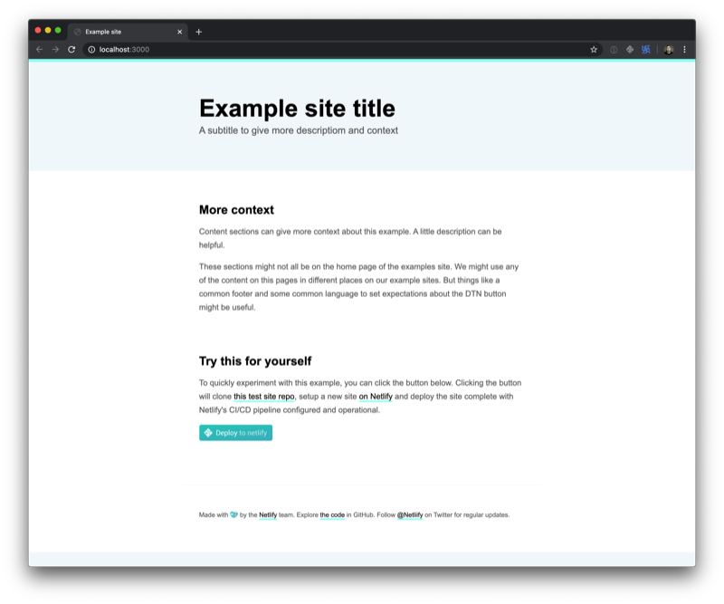

# Example Site Boilerplate

A collection of common content pieces and boilerplate design and assets for use by the Netlify DX team (or anyone, although the content will be rather Netli-centric) when creating example and demo sites.

## Todo

Everything really. We're just breaking ground.

## Sample README conventions.

Some common language and descriptions might be useful. What you'll find below this line

---

